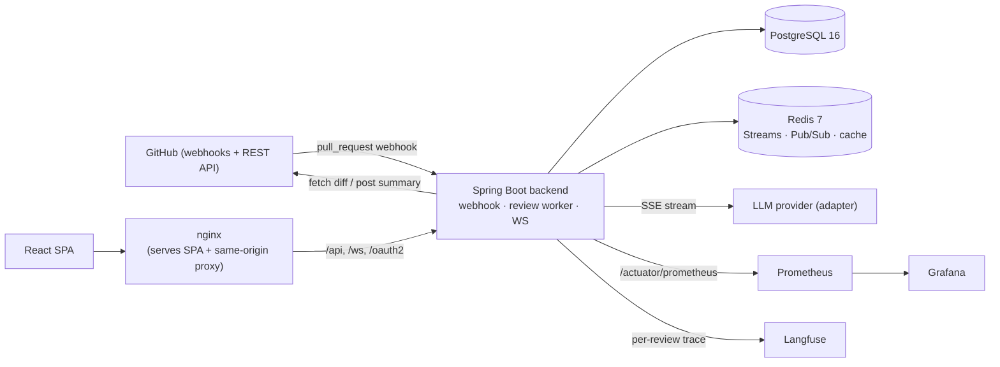

# CodeLens AI — Real-time AI Code Review Platform

> Every GitHub PR gets an AI review in under 30 seconds. Reviewers watch comments stream in
> word-by-word over WebSocket, inline on the diff — exactly like Copilot.

CodeLens AI ingests GitHub PR webhooks idempotently, queues diff analysis through Redis Streams,
runs a current frontier model behind a provider-agnostic adapter, and relays structured comments
(CRITICAL / WARNING / SUGGESTION) to every connected browser. The LLM streams to the backend over
SSE; the backend relays to browsers over STOMP/WebSocket (fanned out across pods via Redis Pub/Sub).

## Features

- GitHub OAuth2 login (session-based)
- Connect repositories — registers a `pull_request` webhook
- PR list with review status (pending / in-progress / reviewed / failed)
- PR detail: side-by-side diff with AI findings shown per file
- AI auto-reviews every new PR; comments stream in real time over WebSocket
- Severity-tagged comments (CRITICAL / WARNING / SUGGESTION), persisted in PostgreSQL
- Idempotent webhook handling (GitHub delivers duplicates) + effectively-once review processing
- Dashboard: review counts, severity distribution, coverage
- Re-review button to re-run the AI on the current head
- Review-quality eval harness that gates CI on bug-catch / false-positive rate

## Tech stack

Spring Boot 4.1.x (Java 21, Maven) · React 18 + TypeScript (Vite) · PostgreSQL 16 · Redis 7
(Streams + Pub/Sub) · WebSocket (STOMP/SockJS) · LLM adapter (local mock / OpenAI; Claude stub) ·
Resilience4j · Prometheus + Grafana · Langfuse · Docker Compose · GitHub Actions.

## Architecture



### Request flow (webhook → real-time review)

1. GitHub fires a `pull_request` webhook → `POST /api/webhooks/github`.
2. Backend verifies the HMAC-SHA256 signature, dedups on `X-GitHub-Delivery` (Redis SETNX), parses PR metadata.
3. A review job is enqueued on the Redis Stream `review-jobs` and the request returns `202` immediately.
4. The consumer fetches the diff (cached), chunks it, and reviews chunks concurrently on virtual threads.
5. LLM tokens stream back and are relayed to `/topic/pr/{id}/review` (cross-pod via Redis Pub/Sub).
6. On completion, comments persist to Postgres (idempotent on `(pr_id, head_sha)`) and a summary posts to the PR.

## Quick start (Docker)

```bash
git clone <your-fork-url> codelensai && cd codelensai
cp .env.example .env       # fill in GitHub OAuth (+ OpenAI if you want the real model)
docker compose up -d --build
```

| Service    | URL                          | Notes                                   |
|------------|------------------------------|-----------------------------------------|
| Frontend   | http://localhost:3000        | SPA + same-origin `/api`, `/ws` proxy   |
| Backend    | http://localhost:8080        | REST + actuator + WebSocket             |
| Prometheus | http://localhost:9090        | scrapes the backend                     |
| Grafana    | http://localhost:3001        | login `admin` / `GRAFANA_ADMIN_PASSWORD`; "CodeLens AI — Overview" dashboard |
| Langfuse   | http://localhost:3002        | LLM tracing (off until you add keys)    |

The default LLM provider is a deterministic local mock (no API key needed). Set `LLM_PROVIDER=gpt5`
plus `OPENAI_API_KEY` and a real `REVIEW_MODEL` in `.env` to use OpenAI.

GitHub OAuth callback URL (register in your GitHub OAuth app): `http://localhost:3000/login/oauth2/code/github`
(in local Vite dev it is `http://localhost:5173/login/oauth2/code/github`).

## Local development (without Docker)

```bash
# infra only
cd codelensai && docker compose -f compose.yaml up -d   # postgres + redis (if Docker available)
./mvnw spring-boot:run                                  # backend on :8080

# frontend (Vite dev server proxies /api,/ws,/oauth2 to :8080)
cd ../frontend && npm install && npm run dev            # :5173
```

## Review-quality eval gate

The `eval/` harness scores the AI against diffs with planted bugs (bug-catch rate, false-positive
rate, severity accuracy) by POSTing to `/api/internal/review-diff`. It runs in CI against the local
provider and fails the build on regression:

```bash
# with the backend running and LLM_PROVIDER=local
python eval/run_eval.py            # report
python eval/run_eval.py --ci       # enforce floors + baseline (used in CI)
```

## Monitoring

- Prometheus scrapes `backend:8080/actuator/prometheus`.
- Grafana auto-provisions the Prometheus datasource and the "CodeLens AI — Overview" dashboard:
  review latency, review queue depth, HTTP 5xx rate, LLM tokens/hour.
- Langfuse traces each review (model, prompt version, tokens, latency) when enabled — set
  `CODELENS_LANGFUSE_ENABLED=true` and paste a project's keys into `.env`.

## CI/CD

`.github/workflows/ci.yml`:

- `test-backend` — Maven build + tests (Postgres + Redis service containers).
- `test-frontend` — lint, unit tests, build.
- `review-quality-eval` — boots the backend (local provider) and runs the eval gate.
- `build-and-push` *(opt-in)* — pushes images to DockerHub on `main`.
- `deploy` *(opt-in)* — deploys to a host over SSH (`docker compose pull && up -d`).

The deploy jobs stay inert until you opt in. Set these repository **Actions variables** and **secrets**:

| Kind     | Name                  | Used for                                |
|----------|-----------------------|-----------------------------------------|
| Variable | `ENABLE_DOCKER_PUSH`  | `true` to enable image build-and-push   |
| Variable | `ENABLE_DEPLOY`       | `true` to enable the SSH deploy         |
| Secret   | `DOCKERHUB_USERNAME`  | DockerHub login + image namespace       |
| Secret   | `DOCKERHUB_TOKEN`     | DockerHub access token                  |
| Secret   | `EC2_HOST`            | deploy host                             |
| Secret   | `EC2_USER`            | deploy SSH user                         |
| Secret   | `EC2_SSH_KEY`         | deploy SSH private key                  |

On the deploy host put `docker-compose.yml` + `.env` in `/opt/codelensai` and set
`BACKEND_IMAGE` / `FRONTEND_IMAGE` in `.env` to the pushed tags so `docker compose pull` works.

## Design notes worth flagging

- **Auth:** GitHub OAuth2-login session auth is used; the master plan's stateless+JWT resource-server
  wiring is intentionally deferred (no JWT issuer/decoder to mint tokens yet). See
  [docs/adr/0004-oauth2-session-vs-jwt.md](docs/adr/0004-oauth2-session-vs-jwt.md).
- **Testcontainers:** the two Testcontainers integration tests are skipped where Docker is absent and
  run in CI.
- **Diff view:** the backend serves the raw unified diff (`GET /api/prs/{id}/diff`); the UI renders it
  side-by-side and falls back to a findings list when no diff is available (local mock / no token).

## Docs

- [docs/SCALING.md](docs/SCALING.md) — Redis Pub/Sub over Kafka for WebSocket fan-out.
- [docs/adr/](docs/adr/) — architecture decision records.
- [docs/future-work.md](docs/future-work.md) — post-MVP differentiators (repo-aware context, risk score, etc.).

## License

MIT
